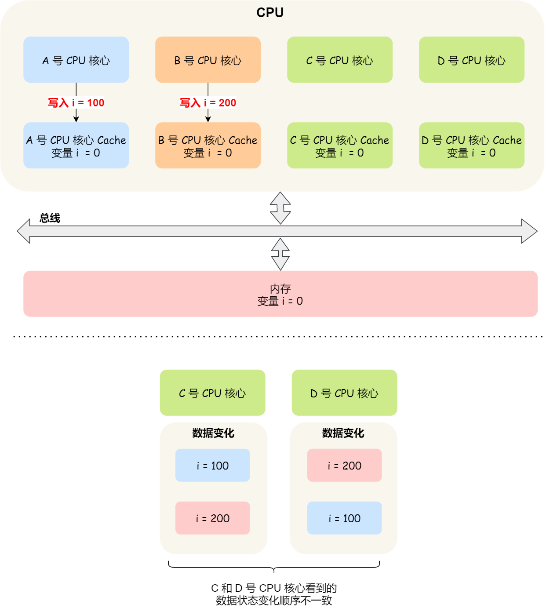
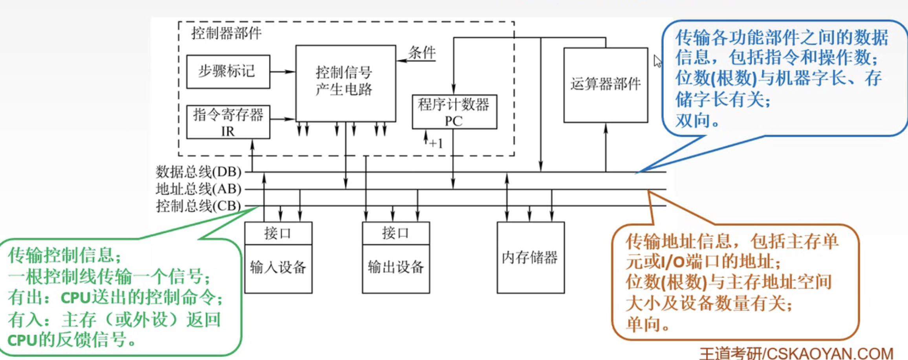

# 计算机组成原理


## 第一章概述

### 图灵机

> 图灵机就是为了代替人手动数学运算的过程


**图灵机组成**

- 一条长<font color=blue>纸带</font>。纸带由一个个连续的格子组成（相当于硬盘），格子上可以记录一些字符（相当于硬盘的数据和程序）。
- <font color=blue>读写头</font>。可以读取纸带上的数据，写入数据到纸带(相当于输入/输出设备)。
  - 读写头上有三个部件。
    - <font color=blue>存储单元</font>，用于存放数据（相当于内存）。
    - <font color=blue>控制单元</font>，识别是指令还是数据。
    - <font color=blue>运算单元</font>，执行运算指令。

**图灵机运行原理**

通过`1+2`的例子来理解。

首先，通过`读写头`来写入「1，2，+」到纸带的三个格子上，然后`读写头`指向1的纸带格子。


`读写头`读到1后，将1交给`控制单元`，`控制单元`发现是数据，会将1写入存储设备中，这个存储设备称为`图灵机的状态`


然后读写头右移一格，将2也写入图灵机的状态。当右移到+的时候，发现是运算符号。「控制单元」发现是运算符号，于是通知「运算单元」工作，「运算单元」将状态的值相加后，将计算结果3再放入到状态中。


最后「运算单元」把结果交给「控制单元」，「控制单元」将结果交给`读写头`，`读写头`将结果写入到`纸带`中。

通过上面1+2的案例，发现图灵机工作原理是，`读写头`将`纸带`上的内容读取到，通过`控制单元`辨别是数据还是运算符，如果是数据则存放到图灵机状态中，如果是运算符将运算符交给`运算单元`工作，`运算单元`将图灵机状态的值进行运算操作，最后将结果返回给`控制单元`，`控制单元`将结果交给`读写头`，`读写头`写入结果到纸带。

### 冯·诺依曼机

计算机硬件系统由<font color=red>中央处理器(CPU)、存储器、总线、输入设备和输出设备</font>5大部件组成。


**1.存储器**

存储器是计算机的存储部件，用来存放程序和数据。

存储器分为<font color=red>主存储器</font>（简称主存，也称内存储器）和<font color=red>辅助存储器</font>（简称辅存，也称外存储器）。


**CPU能够直接访问的存储器是主存储器。辅助存储器用于帮助主存储器记忆更多的信息，辅助存**
**储器中的信息必须调入主存后，才能为CPU所访问**。

**2.中央处理器**

中央处理器也就是我们熟知的CPU，32位和64位主要区别是在于一次能够计算多少个字节数据：

- 32位CPU一次可以计算4个字节； 
- 64位CPU一次可以计算8个字节；

CPU内部主要是有运算器和控制器和寄存器组成。

**3.总线**

总线是用于CPU和内存以及其他设备之间的通信，总线可分为3种：

> 地址总线，用于指定CPU将要操作的内存地址；
> 数据总线，用于读写内存的数据；
> 控制总线，用于发送和接收信号，比如中断、设备复位等信号，CPU收到信号后自然进行响应，这时也需要控制总线；

当CPU要读写内存数据的时候，一般需要通过两个总线：

> 首先要通过「地址总线」来指定内存的地址； 再通过「数据总线」来传输数据；

**4.输入设备**

输入设备向计算机输入数据，计算机经过计算后，把数据输出给输出设备。期间，如果输入设备是键盘，按下按键时是需要和CPU进行交互的，这时就需要用到控制总线了。

键盘、鼠标、扫描仪。。。

**5.输出设备**

输出设备的任务是将计算机处理的结果以人们所能接受的形式或其他系统所要求的信息形式输出。最常用、最基本的输出设备是显示器、打印机。计算机的输入/输出设备（简称/设备）是计算机与外界联系的桥梁，是计算机中不可缺少的重要组成部分。

### 计算机多级层次结构


### 计算机性能指标

1.机器字长

2.数据通路带宽

3.主存容量

**4.运算速度**

吞吐量：

> 单位时间内处理的请求量。

响应时间：

> 用户发送一条请求，到系统通过处理后给出响应结果所需要的时间。

主频（CPU时钟频率）：

> 简单说是CPU运算时的工作频率（1秒内发生的同步脉冲数）的简称。单位是Hz。它决定计算机的运行速度，主频越高，执行指令速度越快。通常CPU主频1.8GHz、2.4GHz、2.8GHz等。

CPU时钟周期：

> CPU时钟周期=1/主频
>
> 比如一个2GHz主频的CPU，一个时钟周期是0.5ns

## 第二章 数据表示与计算

### 进制

- 二进制 （0-1）
- 八进制（0-7）
- 十进制（0-9）
- 十六进制（0-F）

**进制转换**

**二进制 转 十进制**


**十进制 转 二进制**


**十进制 转 八进制和十六进制**


**八进制和十六进制 转 十进制**


**二进制转八进制十六进制**


### 编码

ASCII编码


### 定点数

#### 1.原码

原码就是符号位加上真值的绝对值, 即用第一位表示符号, 其余位表示值. 

原码是人脑最容易理解和计算的表示方式.

#### 2.反码

反码的表示方法是:

> 正数的反码是其本身
>
> 负数的反码是在其原码的基础上, 符号位不变，其余各个位取反.

#### 3.补码

补码的表示方法是:

> 正数的补码就是其本身
>
> 负数的补码是在其原码的基础上, 符号位不变, 其余各位取反, 最后+1. (即在反码的基础上+1)
>

#### 4.移码

> 只与补码符号位相反
>


### 逻辑运算

与、或、非、异或

 与关系，所有的都是真结果才是真

 或关系，至少一个为真结果也为真

 非关系，真为假，假为真

**异或**，相同为真，不同为假；运算规则：0^0=0；  0^1=1；  1^0=1；  1^1=0；

任何数^0，都是它本身

例题：

> a=“甲”，b=“乙”
>
> 交换a和b的值
>
> a=a^b       
>
> b=a^b    //把a带入，b=甲^乙^乙，因为相同为真，b=甲^0，b=“甲”
>
> a=a^b   //把a和b带入，a=甲^乙^甲，因为相同为真，a=乙^0，a=乙
>
> 最终输出结果：a=“乙”，b=“甲”
>


## 第三章 <font color=red>存储系统</font>

### 存储系统分类

<font color=grays>**按在计算机中的作用（层次）分类：**</font>

<font color=grays>1.主存储器。</font>

> 主存储器。简称主存，又称内存储器（内存），用来存放计算机运行期间所需的大量程序和数据，CPU可以直接随机地对其进行访问，也可以和高速缓冲存储器（Cache）及辅助存储器交换数据。其特点是容量较小、存取速度较快、每位价格较高。

<font color=grays>2.辅助存储器。</font>

> 辅助存储器。简称辅存，又称外存储器（外存），是主存储器的后援存储器，用来存放当
> 前暂时不用的程序和数据，以及一些需要永久性保存的信息，它不能与CPU直接交换信
> 息。其特点是容量极大、存取速度较慢、单位成本低。

<font color=grays>3.高速缓冲存储器。</font>

> 高速缓冲存储器。简称Cache，位于主存和CPU之间，用来存放正在执行的程序段和数据，以便CPU能高速地使用它们。Cache的存取速度可与CPU的速度相匹配，但存储容
> 量小、价格高。目前的高档计算机通常将它们制作在CPU中。

<font color=grays>**存储器的层次化结构：**</font>

https://blog.csdn.net/qq_38877888/article/details/103118068


主存能与CPU直接交换信息；

辅存则要通过主存与CPU交换信息；

主存与CPU、Cache、辅存都能交换信息。


### 高速缓存

由于程序的转移概率不会很低，数据分布的离散性较大，所以单纯依靠并行主存系统提高主存系统的频宽是有限的。这就必须从系统结构上进行改进，即采用存储体系。通常将存储系统分为“Cache-主存”层次和“主存-辅存”层次。

> 只保存主存中比较活跃的数据。


#### L1 ⾼速缓存

L1 ⾼速缓存的访问速度⼏乎和寄存器⼀样快，通常只需要 **2~4** 个时钟周期，⽽⼤⼩在⼏⼗ KB 到⼏百KB 不等。

每个 CPU 核⼼都有⼀块属于⾃⼰的 L1 ⾼速缓存，指令和数据在 L1 是分开存放的，所以 L1 ⾼速缓存通常分成**指令缓存**和**数据缓存**。 

在 Linux 系统，我们可以通过这条命令，查看 CPU ⾥的   `L1数据缓存`的容量⼤⼩：

```shell
$ cat /sys/devices/system/cpu/cpu0/cache/index0/size
32K
```

⽽查看 `L1指令缓存`的容量⼤⼩，则是：

```shell
$ cat /sys/devices/system/cpu/cpu0/cache/index1/size
32K
```

#### L2高速缓存

L2高速缓存同样每个CPU核心都有，但是L2高速缓存位置比L1高速缓存距离CPU核心更远，它大小比L1高速缓存更大，CPU型号不同大小也就不同，通常大小在几百KB到几MB不等，访问速度则更慢，速度在**10~20**个时钟周期。

在Linux系统，我们可以通过这条命令，查看CPU里的`L2Cache`的容量大小：

```shell
$ cat/sys/devices/system/cpu/cpu0/cache/index2/size 
256K
```

#### L3高速缓存

L3高速缓存通常是多个CPU核心共用的，位置比L2高速缓存距离CPU核心更远，大小也会更大些，通常大小在几MB到几十MB不等，具体值根据CPU型号而定。

访问速度相对也比较慢一些，访问速度在**20~60**个时钟周期。

在Linux系统，我们可以通过这条命令，查看CPU里的`L3Cache`的容量大小：

```shell
$ cat/sys/devices/system/cpu/cpu0/cache/index3/size 
3072K
```

### 内存

内存用的芯片和CPUCache有所不同，它使用的是一种叫作**DRAM**（*Dynamic Random AccessMemory*，动态随机存取存储器）的芯片。

相比SRAM，DRAM的密度更高，功耗更低，有更大的容量，而且造价比SRAM芯片便宜很多。

> 断电数据丢失原因：
>
> DRAM存储一个bit数据，只需要一个晶体管和一个电容就能存储，但是因为数据会被存储在电容里，电容会不断漏电，所以需要「定时刷新」电容，才能保证数据不会被丢失，这就是DRAM之所以被称为「动态」存储器的原因，只有不断刷新，数据才能被存储起来。

DRAM的数据访问电路和刷新电路都比SRAM更复杂，所以访问的速度会更慢，内存速度大概在**200~300**个时钟周期之间。

### SSD/HDD 硬盘

**SSD**（*Solid-state disk*） 就是我们常说的固体硬盘，结构和内存类似，但是它相⽐内存的优点是断电后数

据还是存在的，⽽内存、寄存器、⾼速缓存断电后数据都会丢失。内存的读写速度⽐ SSD ⼤概快

**10~1000** 倍。

当然，还有⼀款传统的硬盘，也就是机械硬盘（*Hard Disk Drive, HDD*），它是通过物理读写的⽅式来访问数据的，因此它访问速度是⾮常慢的，它的速度⽐内存慢 10W 倍左右。

由于 SSD 的价格快接近机械硬盘了，因此机械硬盘已经逐渐被 SSD 替代了。

### 虚拟内存

当运行数据超过内存限度，部分数据自动“溢出”，这时系统会将硬盘上的部分空间模拟成内存——虚拟内存，并且将暂时不运行的程序或不使用的数据存放到虚拟内存中等待需要时调用

### <font color=red>CPU、主存、缓存关系</font>

> CPU Cache 的数据是从内存加载过来的，写回数据的时候也只写回到内存，CPU Cache 不会直接把数据写到硬盘，也不会直接从硬盘加载数据，⽽是先加载到内存，再从内存加载到 CPU Cache 中。


每个存储器只和相邻的⼀层存储器设备打交道，并且存储设备为了追求更快的速度，所需的材料成本必然也是更⾼，也正因为成本太⾼，所以 **CPU** 内部的寄存器、**L1\L2\L3 Cache** 只好⽤较⼩的容量，相反内存、硬盘则可⽤更⼤的容量，这就我们今天所说的存储器层次结构。

CPU访问数据过程

当 CPU 需要访问内存中某个数据的时候，如果寄存器有这个数据，CPU 就直接从寄存器取数据即可，如果寄存器没有这个数据，CPU 就会查询 L1 ⾼速缓存，如果 L1 没有，则查询 L2 ⾼速缓存，L2 还是没有的话就查询 L3 ⾼速缓存，L3 依然没有的话，才去内存中取数据。


## 第四章 指令系统

### 指令的格式


### 指令的寻址方式

#### 指令寻址

指令寻址方式有两种：一种是`顺序寻址方式`，另一种是`跳跃寻址方式`。

1）顺序寻址可通过程序计数器（PC）加1（1个指令字长），自动形成下一条指令的地址。 

2）跳跃寻址通过转移类指令实现。所谓跳跃，是指下条指令的地址码不由程序计数器给出，
而由本条指令给出下条指令地址的计算方式。注意，是否跳跃可能受到状态寄存器和操作数的控制，而跳跃到的地址分为绝对地址（由标记符直接得到）和相对地址（相对于当前指令地址的偏移量），跳跃的结果是当前指令修改PC值，所以下一条指令仍然通过程序计数器（PC）给出。

#### 数据寻址


### X86汇编指令入门


#### MOV指令

mov指令将第二个操作数（寄存器的内容、内存中的内容或常数值）复制到第一个操作数（寄存器或内存）。但不能用于直接从内存复制到内存，其语法如下：

```
mov <reg>,<reg>
mov <reg>,<mem>
mov <mem>r' <reg>
mov <reg>1 <con>
mov <mem>,<con>
```

#### push指令

将操作数压入内存栈中。

#### POP指令

与push相反，出栈。

#### add/sub

add两数相加，结果赋值给第一个操作数。

sub两数相减，结果赋值给第一个操作数。

#### Inc/dec

inc表示操作数自加1

dec表示操作数自加减1

#### imul（乘）

两数相乘

#### idiv（除）

两数相除

#### and/or/xor

逻辑与、逻辑或、逻辑异或

#### not

指令反转


## 第五章 中央处理器

中央处理器（CPU）由`运算器`和`控制器`组成。其中，**控制器**的功能是负责协调并控制计算机各部件执行程序的指令序列，包括取指令、分析指令和执行指令；**运算器**的功能是对数据进行加工。

> 1. 指令控制。完成取指令、分析指令和执行指令的操作，即程序的顺序控制。
> 2. 操作控制。一条指令的功能往往由若干操作信号的组合来实现。CPU管理并产生由内存取出的每条指令的操作信号，把各种操作信号送往相应的部件，从而控制这些部件按指令的要求进行动作。
> 3. 时间控制。对各种操作加以时间上的控制。时间控制要为每条指令按时间顺序提供应有的控制信号。
> 4. 数据加工。对数据进行算术和逻辑运算。
> 5. 中断处理。对计算机运行过程中出现的异常情况和特殊请求进行处理。

### CPU的组成结构

在计算机系统中，计算机主要由`运算器`和`控制器`两大部分组成。


#### 运算器

运算器接收从控制器送来的命令并执行相应的动作，对数据进行加工和处理。运算器是计算机对数据进行加工处理的中心，它主要由算术逻辑单元（ALU）、暂存寄存器、累加寄存器（ACC）、通用寄存器组、程序状态字寄存器（PSW）、移位器、计数器（CT）等组成。

#### 控制器

控制整个系统的指挥中枢。

**控制器**由**程序计数器**（PC）、指令寄存器（IR）、指令译码器、存储器地址寄存器（MAR）、存储器数据寄存器（MDR）、时序系统和微操作信号发生器等组成。

> 1）程序计数器。用于指出下一条指令在主存中的存放地址。CPU根据PC的内容去主存中取指令。因程序中指令（通常）是顺序执行的，所以PC有自增功能。
> 2）指令寄存器。用于保存当前正在执行的那条指令。
> 3）指令译码器。仅对操作码字段进行译码，向控制器提供特定的操作信号。
> 4）存储器地址寄存器。用于存放要访问的主存单元的地址。
> 5）存储器数据寄存器。用于存放向主存写入的信息或从主存读出的信息。
> 6）时序系统。用于产生各种时序信号，它们都由统一时钟（CLOCK）分频得到。

控制器的工作原理是，根据指令操作码、指令的执行步骤（微命令序列）和条件信号来形成当前计算机各部件要用到的控制信号。计算机整机各硬件系统在这些控制信号的控制下协同运行，产生预期的执行结果。

### CPU缓存数据结构和读取过程

#### 数据结构

CPU Cache 的数据是从内存中读取过来的，它是以⼀⼩块⼀⼩块读取数据的，⽽不是按照单个数组元素来读取数据的，在 CPU Cache 中的，这样⼀⼩块⼀⼩块的数据，称为 **Cache Line**（缓存块）。

你可以在你的 Linux 系统，⽤下⾯这种⽅式来查看 CPU 的 Cache Line，你可以看我服务器的 L1 Cache Line ⼤⼩是 64 字节，也就意味着 **L1 Cache** ⼀次载⼊数据的⼤⼩是 **64** 字节。

```shell
# 查看L1Cache数据缓存一次载入数据的大小
$ cat /sys/devices/system/cpu/cpu0/cache/index0/coherency_line_size cat
64
```


#### 读取过程

CPU在访问内存数据是一小块一小块读取的。这一小块在内存中我们称为**内存块**（Block），读取的时候我们需要拿内存地址去缓存中查。


我们发现，**内存块**数据写入缓存时，取余的方式写入同一个**Cache Line**中，为了区分来自不同的内存块，在cache Line中还会存储一个**组标记（Tag）**。

**内存地址去访问cache**

⼀个内存的访问地址，包括**组标记**、**CPU Line索引**、**偏移量**这三种信息，于是 CPU 就能通过这些信息，在 CPU Cache 中找到缓存的数据。⽽对于 CPU Cache ⾥的数据结构，则是由**索引**+**有效位 **+**组标记**+**数据块**组成


如果内存中的数据已经在CPU Cahe中了，那CPU访问一个内存地址的时候，会经历这4个步骤：

> 1.根据内存地址中索引信息，计算在CPUCahe中的索引，也就是找出对应的CPULine的地址；
>
> 2.找到对应CPULine后，判断CPULine中的有效位，确认CPULine中数据是否是有效的，如果是无效的，CPU就会直接访问内存，并重新加载数据，如果数据有效，则往下执行；
>
> 3.对比内存地址中组标记和CPULine中的组标记，确认CPULine中的数据是我们要访问的内存数据，如果不是的话，CPU就会直接访问内存，并重新加载数据，如果是的话，则往下执行；
>
> 4、根据内存地址中偏移量信息，从CPULine的数据块中，读取对应的字。


### CPU缓存一致性


#### 写直达

保持内存与 Cache ⼀致性最简单的⽅式是，把数据同时写⼊内存和 **Cache** 中，这种⽅法称为写直达

（**Write Through**）。


写前会先判断数据是否在cpu cache中，

如果已经在 Cache ⾥⾯，先将数据更新到 Cache ⾥⾯，再写⼊到内存⾥⾯；

如果数据没有在 Cache ⾥⾯，就直接把数据更新到内存⾥⾯。

#### 写回

既然写直达由于每次写操作都会把数据写回到内存，⽽导致影响性能，于是为了要减少数据写回内存的频率，就出现了写回（**Write Back**）的⽅法。


如果当发生写操作时，数据已经在 CPU Cache 里的话，则把数据更新到 CPU Cache 里，同时标记 CPU Cache 里的这个 Cache Block 为脏（Dirty）的，这个脏的标记代表这个时候，我们 CPU Cache 里面的这个 Cache Block 的数据和内存是不一致的，这种情况是不用把数据写到内存里的；

如果当发生写操作时，数据所对应的 Cache Block 里存放的是「别的内存地址的数据」的话，就要检查这个 Cache Block 里的数据有没有被标记为脏的，如果是脏的话，我们就要把这个 Cache Block 里的数据写回到内存，然后再把当前要写入的数据，写入到这个 Cache Block 里，同时也把它标记为脏的；如果 Cache Block 里面的数据没有被标记为脏，则就直接将数据写入到这个 Cache Block 里，然后再把这个 Cache Block 标记为脏的就好了。

可以发现写回这个方法，在把数据写入到 Cache 的时候，只有在缓存不命中，同时数据对应的 Cache 中的 Cache Block 为脏标记的情况下，才会将数据写到内存中，而在缓存命中的情况下，则在写入后 Cache 后，只需把该数据对应的 Cache Block 标记为脏即可，而不用写到内存里。


#### 缓存一致性问题


假如有两个线程，线程1执行i++,缓存a中i=1，由于写回策略，缓存数据没有写入内存。这时线程2读取i=0，是脏数据。




假设我们有一个含有 4 个核心的 CPU，这 4 个核心都操作共同的变量 i（初始值为 0 ）。A 号核心先把 i 值变为 100，而此时同一时间，B 号核心先把 i 值变为 200，这里两个修改，都会「传播」到 C 和 D 号核心。

但是可能由于C和D读取的顺序不一样，依旧不能保证缓存一致性。

所以要保证缓存一致性，必须要有`写传播`、`事物串行化`。

### 解决CUP缓存一致性问题

#### 总线嗅探

`写传播`的原则就是当某个CPU核心更新了Cache中的数据，要把该事件广播通知到其他核心。最常见实现的方式是总线嗅探（Bus Snooping）。

我还是以前面的i变量例子来说明总线嗅探的工作机制，当A号CPU核心修改了L1Cache中i变量的值，通过总线把这个事件广播通知给其他所有的核心，然后每个CPU核心都会监听总线上的广播事件，并检查是否有相同的数据在自己的L1Cache里面，如果B号CPU核心的L1Cache中有该数据，那么也需要把该数据更新到自己的L1Cache。

可以发现，总线嗅探方法很简单，CPU需要每时每刻监听总线上的一切活动，但是不管别的核心的Cache是否缓存相同的数据，都需要发出一个广播事件，这无疑会加重总线的负载。

另外，总线嗅探只是保证了某个CPU核心的Cache更新数据这个事件能被其他CPU核心知道，但是并不能保证事务串形化。

于是，有一个协议基于总线嗅探机制实现了事务串形化，也用状态机机制降低了总线带宽压力，这个协议就是MESI协议，这个协议就做到了CPU缓存一致性。

#### MESI协议

MESI 协议其实是 4 个状态单词的开头字母缩写，分别是：

- *Modified*，已修改
- *Exclusive*，独占
- *Shared*，共享
- *Invalidated*，已失效

这四个状态来标记 Cache Line 四个不同的状态。

「已修改」状态就是我们前面提到的脏标记，代表该 Cache Block 上的数据已经被更新过，但是还没有写到内存里。而「已失效」状态，表示的是这个 Cache Block 里的数据已经失效了，不可以读取该状态的数据。

「独占」和「共享」状态都代表 Cache Block 里的数据是干净的，也就是说，这个时候 Cache Block 里的数据和内存里面的数据是一致性的。

「独占」和「共享」的差别在于，独占状态的时候，数据只存储在一个 CPU 核心的 Cache 里，而其他 CPU 核心的 Cache 没有该数据。这个时候，如果要向独占的 Cache 写数据，就可以直接自由地写入，而不需要通知其他 CPU 核心，因为只有你这有这个数据，就不存在缓存一致性的问题了，于是就可以随便操作该数据。

另外，在「独占」状态下的数据，如果有其他核心从内存读取了相同的数据到各自的 Cache ，那么这个时候，独占状态下的数据就会变成共享状态。

那么，「共享」状态代表着相同的数据在多个 CPU 核心的 Cache 里都有，所以当我们要更新 Cache 里面的数据的时候，不能直接修改，而是要先向所有的其他 CPU 核心广播一个请求，要求先把其他核心的 Cache 中对应的 Cache Line 标记为「无效」状态，然后再更新当前 Cache 里面的数据。

1. 当 A 号 CPU 核心从内存读取变量 i 的值，数据被缓存在 A 号 CPU 核心自己的 Cache 里面，此时其他 CPU 核心的 Cache 没有缓存该数据，于是标记 Cache Line 状态为「独占」，此时其 Cache 中的数据与内存是一致的；
2. 然后 B 号 CPU 核心也从内存读取了变量 i 的值，此时会发送消息给其他 CPU 核心，由于 A 号 CPU 核心已经缓存了该数据，所以会把数据返回给 B 号 CPU 核心。在这个时候， A 和 B 核心缓存了相同的数据，Cache Line 的状态就会变成「共享」，并且其 Cache 中的数据与内存也是一致的；
3. 当 A 号 CPU 核心要修改 Cache 中 i 变量的值，发现数据对应的 Cache Line 的状态是共享状态，则要向所有的其他 CPU 核心广播一个请求，要求先把其他核心的 Cache 中对应的 Cache Line 标记为「无效」状态，然后 A 号 CPU 核心才更新 Cache 里面的数据，同时标记 Cache Line 为「已修改」状态，此时 Cache 中的数据就与内存不一致了。
4. 如果 A 号 CPU 核心「继续」修改 Cache 中 i 变量的值，由于此时的 Cache Line 是「已修改」状态，因此不需要给其他 CPU 核心发送消息，直接更新数据即可。
5. 如果 A 号 CPU 核心的 Cache 里的 i 变量对应的  Cache Line 要被「替换」，发现  Cache Line 状态是「已修改」状态，就会在替换前先把数据同步到内存。

所以，可以发现当 Cache Line 状态是「已修改」或者「独占」状态时，修改更新其数据不需要发送广播给其他 CPU 核心，这在一定程度上减少了总线带宽压力。


## 第六章 总线

随着计算机的发展和应用领域的不断扩大，I/O设备的种类和数量也越来越多。为了更好地解决I/O设备和主机之间连接的灵活性问题，计算机的结构从分散连接发展为总线连接。为了进一步简化设计，又提出了各类总线标准。

**总线**是一组能为多个部件**分时共享**的公共信息传送**线路**。

特性：

1.机械特性：尺寸、形状、管脚数、排列顺序
2.电气特性：传输方向和有效的电平范围
3.功能特性：每根传输线的功能（地址、数据、控制） 
4.时间特性：信号的时序关系

### 总线分类

1.片内总线

片内总线是芯片内部的总线。
它是CPU芯片内部寄存器与寄存器之间、寄存器与ALU之间的公共连接线。

2.系统总线



系统总线是计算机系统内各功能部件（CPU、主存、I/0接口）之间相互连接的总线。按系统总线传输信息内容的不同，又可分为3类：数据总线、地址总线和控制总线。

1）数据总线用来传输各功能部件之间的数据信息，它是双向传输总线，其位数与机器字长、存储字长有关。
2）地址总线用来指出数据总线上的源数据或目的数据所在的主存单元或I/O端口的地址，它是单向传输总线，地址总线的位数与主存地址空间的大小有关。
3）控制总线传输的是控制信息，包括CPU送出的控制命令和主存（或外设）返回CPU的反馈信号。

3.通信总线

通信总线是用于计算机系统之间或计算机系统与其他系统（如远程通信设备、测试设备）之间信息传送的总线，通信总线也称为外部总线。

## 第七章 输入/输出


